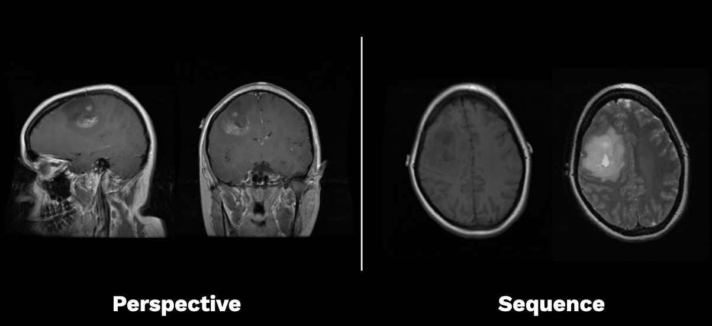
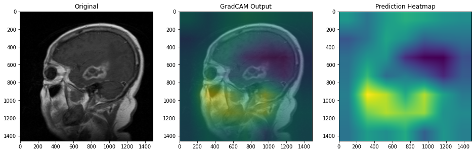

# Brain MRI Classification 

This repository contains complete Propulsion Academy students' final project on Brain MRI Classification using Transfer Learning and Siamese Network. 

The project was done in collaboration with the former student of Propulsion Academy Data Science Program, the Radiation Oncology Resident at Kantonsspital Winterthur, [Paul Windisch](https://www.linkedin.com/in/paul-windisch/). 

## Authors

[Cornelia K. Schmitz](https://www.linkedin.com/in/ckschmitz/),  [Norbert Braeker](https://www.linkedin.com/in/norbert-braeker/)

## Supervisors

[Nitin Kumar](https://www.linkedin.com/in/drnitinkumar/), [Badru Stanicki](https://www.linkedin.com/in/badrustanicki/) 

## Purpose 

The goal of the project is to differentiate perspective and acquisition sequence for brain MRIs. A tumor in a brain MRI can look considerably different depending on perspective and acquisition sequence as you can see below:

When training a neural network with slices like that, this can be a problem and greatly increase the amount of learning data required. 
Since a standard MRI study contains different perspectives and sequences that do not follow a standardized nomenclature, a way to automatically label a slice with these features, could be helpful in a number of different use cases. 

## Data 

Publicly available brain MRI dataset TCGA-GBM comprising more than 250 patients with glioblastoma, a highly malignant brain tumor.

The MRIs are free to access and can be downloaded [here](https://wiki.cancerimagingarchive.net/display/Public/TCGA-GBM#a09ec1d633834e22b5647e3117766bda)

## Requirements

The [Environment](environment.yml)
 file contains all the necessary python packages.  

## How to work with this repo

### Part 1. Processing the data

FRun `create_json.ipynb` notebook to process the data. This notebook creates a .JSON file needed by the other notebooks and therefore it should be run in advance.

It creates a .JSON file containing information about the images of the data used like `patient-id`, `image-name`, and labels for `perspective`, `sequence` and these combined. It also creates an `image-number` for counting the images taken from the same original DCIM image sequence.

### Part 2. Running the code

The following notebooks depend on the created .JSON file and can be run independently from each other.

All of these contain data loading, data sampling, image augmentation, model definition and training, model evaluation with validation data and model predicting with test data. The  `src` folder contains helper functions. 

- `Transfer_Learning_ResNet.ipynb`: Transfer learning (uses **perspective** label by default, changeable).

- `Transfer_Learning_ResNet_GradCAM.ipynb`:  Transfer learning (uses **sequence** label by default, changeable). Additionally, contains GradCAM heatmap.

- `DualOutput_Transfer_Learning_ResNet.ipynb`: Transfer learning (uses combined **perspective-sequence** label) by default. This is the multi-output model predicting two labels at once. 

- `Bayesian_Transfer_Learning_ResNet.ipynb`:  Transfer learning (uses **sequence** label by default). Additionally, contains an uncertainty evaluation using Bayesian theory.

### Part 3. Example results

In the figure below there is an output of the `Transfer_Learning_ResNet_GradCAM.ipynb` notebook. [Grad-CAM](https://github.com/nejlag/Grad-CAM) is the Gradient-weighted Class Activation Mapping, the technolofy, used for increasing the explainability of the deep neural networks output. 

For each image: 

   - The first column is the original mri image
   - The second column is the GradCam output
   - The last column is the prediction heatmap
